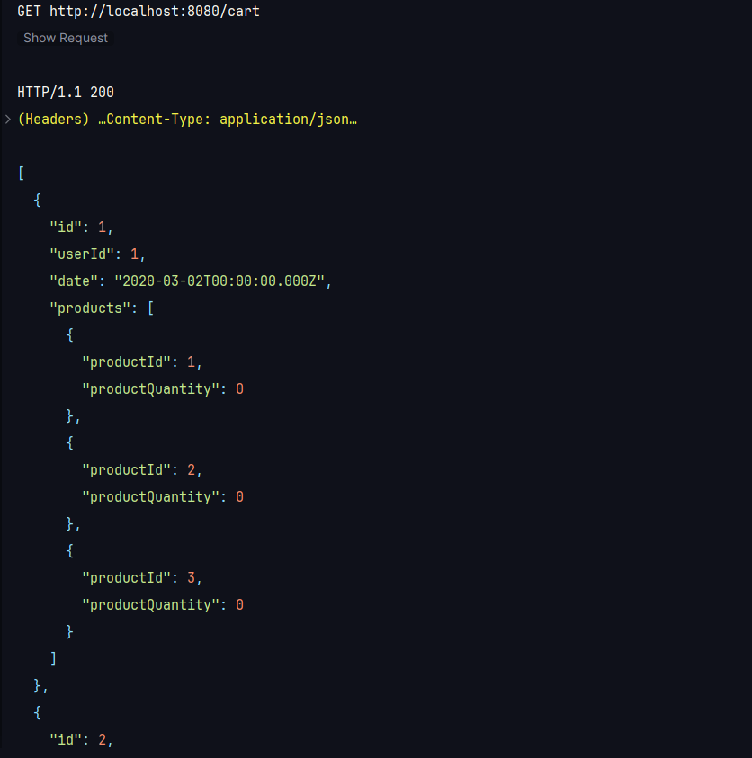
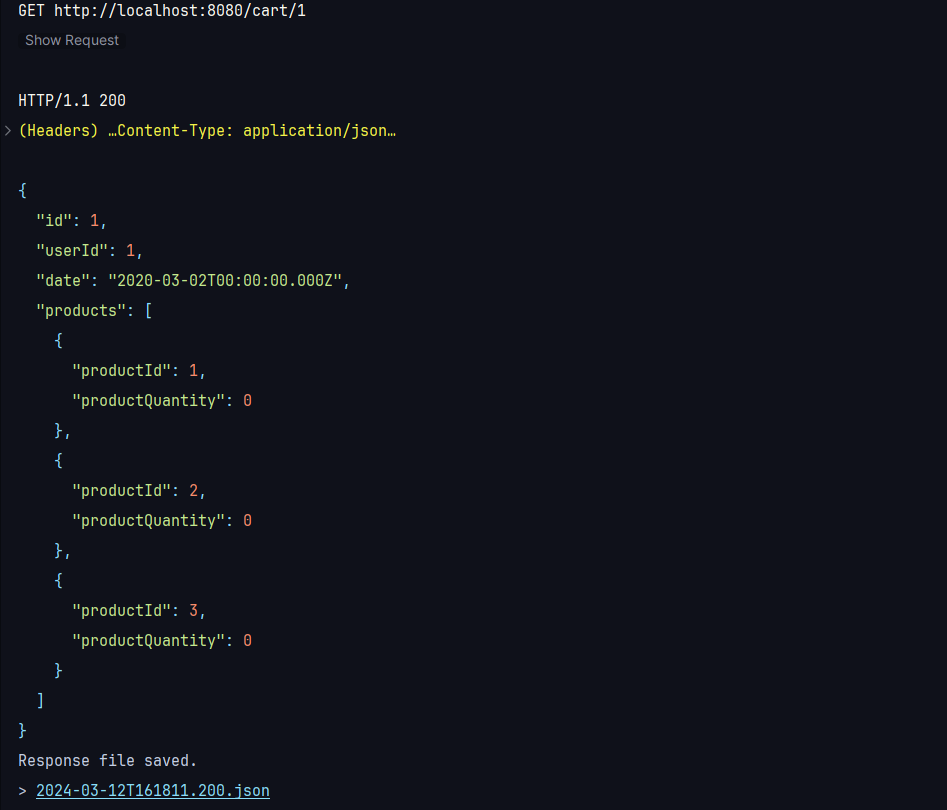
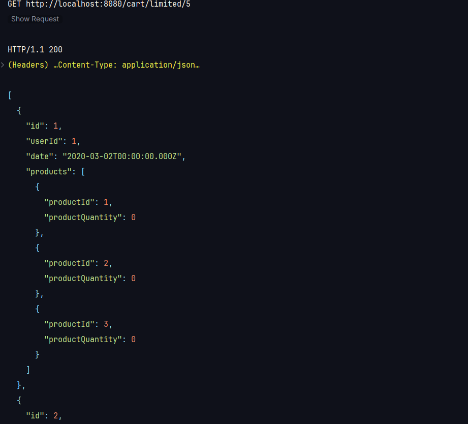
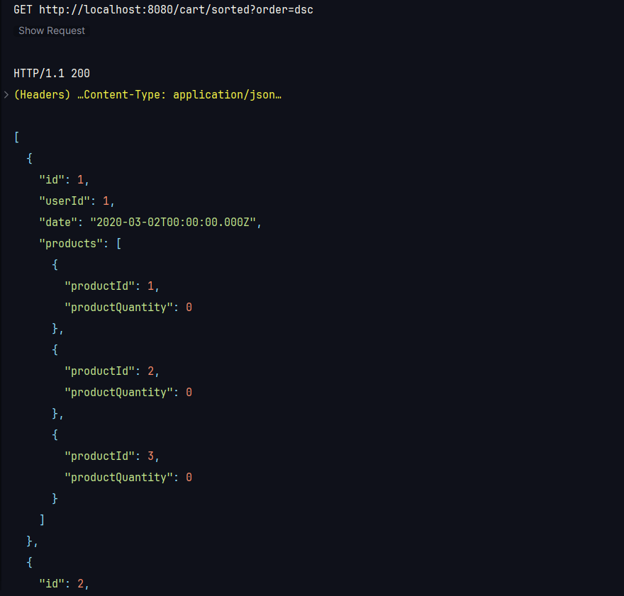
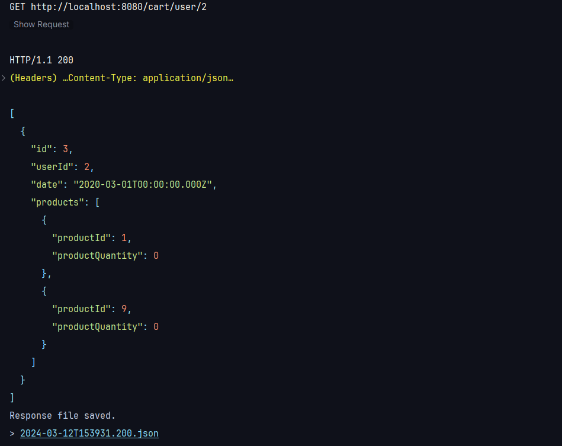
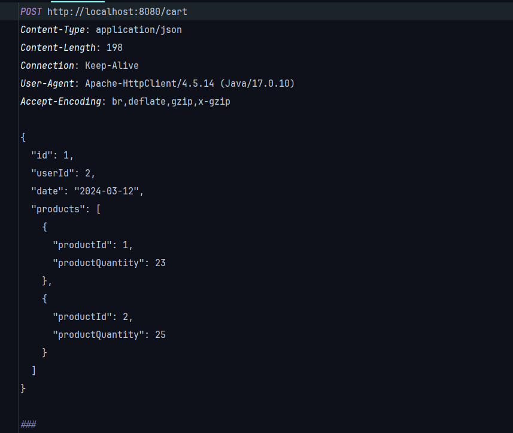
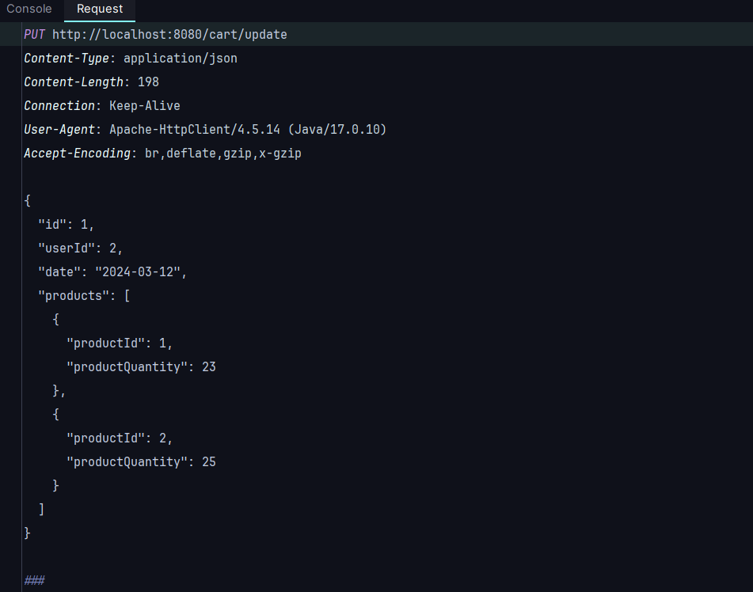
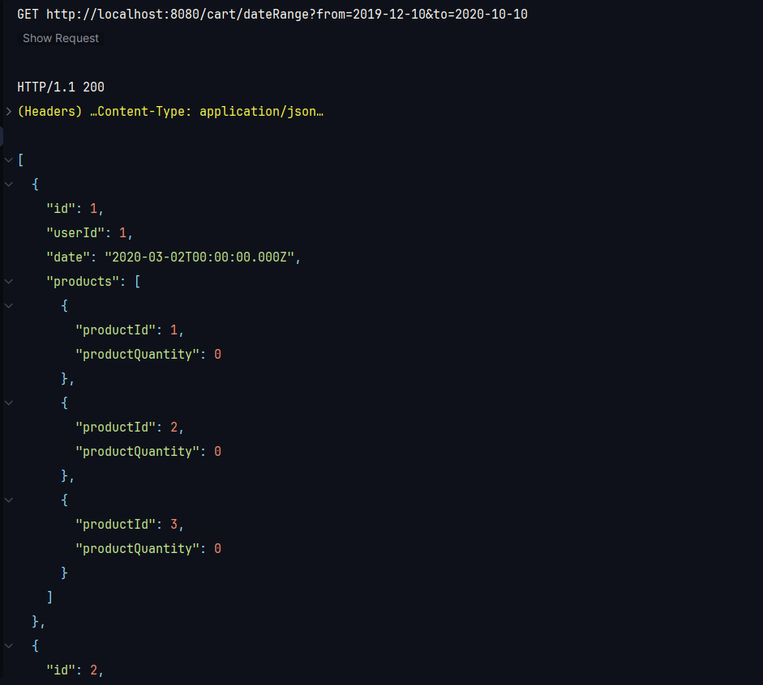

# FakeStore Cart API Service

This is a simple API service that provides a cart serivce for a fake store. This is built using Spring Boot and Java.

## How to run

- You should have Java 17 installed on your machine.
- Clone the repository.
- Run the following command to start the application:

[//]: # (I have used gradle as the build tool. You can use maven as well. The following command is for gradle. If you are using maven, you can use the following command: `mvn spring-boot:run`)

```bash
./gradlew bootRun
```

## API Endpoints

### Get Cart
```
GET /cart
```
This endpoint returns the current cart.

### Add Item to Cart
```
POST /cart
```
This endpoint adds an item to the cart. The request body should be a JSON object with the following properties:
- 'id' ```Long``` (required): The ID of the cart.
- 'userId'```Long``` (required): The ID of the user.
- 'date'```String``` (required): The date the item was added to the cart.
- 'products'```Array``` (required): An array of products in the cart. Each product should have the following properties:
  - 'id'```int``` (required): The ID of the product.
  - 'quantity'```int``` (required): The quantity of the product in the cart.

### Remove Item from Cart
```
DELETE /cart/{id}
```
This endpoint removes an item from the cart.

### Update Item in Cart
```
PUT /update
```
This endpoint updates an item in the cart. The request body should be a JSON object with the following properties:
- 'id' ```Long``` (required): The ID of the cart.
- 'userId'```Long``` (required): The ID of the user.
- 'date'```String``` (required): The date the item was added to the cart.
- 'products'```Array``` (required): An array of products in the cart. Each product should have the following properties:
    - 'id'```int``` (required): The ID of the product.
    - 'quantity'```int``` (required): The quantity of the product in the cart.

### Get Cart by ID
```
GET /cart/{id}
```
This endpoint returns the cart with the specified ID.

### Get Cart by User ID
```
GET /user/{userId}
```
This endpoint returns the cart with the specified user ID.

### Get Limited Cart
```
GET /cart/limited/{limit}
```
This endpoint returns the cart with the specified limit.

### Sorted Products
```
GET /cart/sorted?order={order}
```
This endpoint returns the cart with the specified order.

### Get Cart by Date

```
GET /cart/dateRange?from={from}&to={to}
```
This endpoint returns the carts added between the specified dates

## Test Results

### Get all carts


### Get Cart by Id


### Get limited number of carts


### Get carts in sorted order


### Get by userId


### Add new cart
Request info


Result


### Update Product
Request info


Result


### Delete Product


### Get Products Between the specified time period
